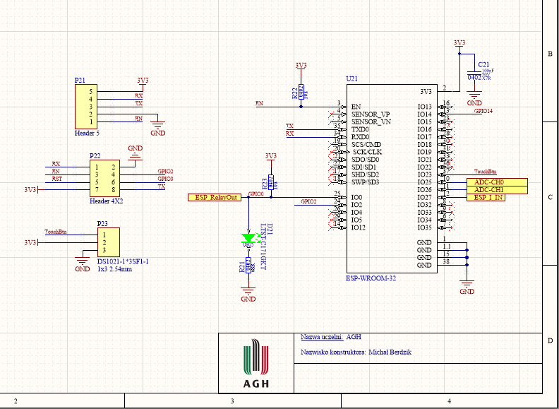

# ESP32-WiFi-Relay
WiFi module to control 230V device via relay

## PCB Top side

## PCB Bottom side

## Schematic of block schematic

## Schematic of power circuit

## Schematic of power meting circuit

## Schematic of ESP32 connection

## Schematic of relay circuit

## Schematic of additional touch button

